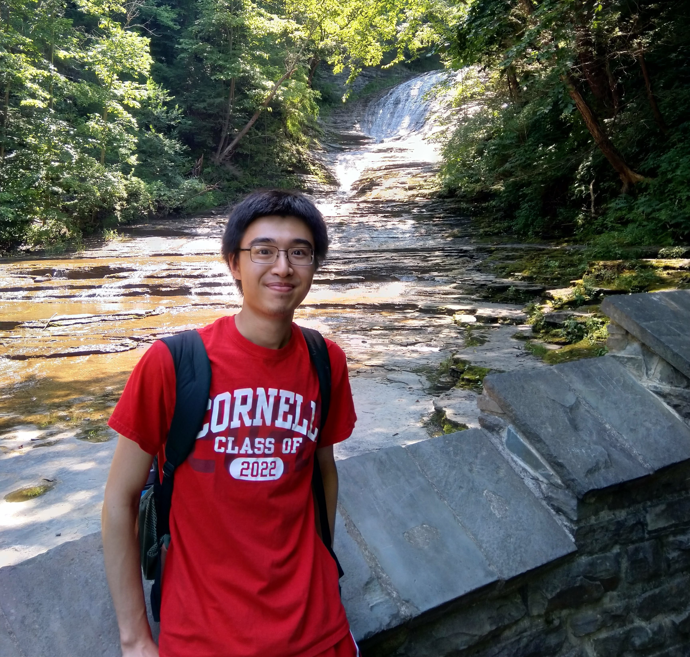

## Hey!

I’m Stanley and I’m currently a sophomore studying computer science at Cornell University’s College of Engineering. I am a software developer, but I’ve been branching out to other areas such as computer vision as well.

Recently, I’ve been doing research that combines robotics and computer vision to accomplish the task of building furniture. I’ve also worked on a variety of projects, from a ray tracing engine written from scratch to a chatbot that recommends movies!

I was also the lead programmer and captain of my high school’s Zero Robotics team, StuyNaught. Currently, I'm a member of Cornell Cup Robotics, and am currently working on a project involving facial recognition.

When I’m not at my computer, I enjoy skiing, swimming, and teaching myself the drums. I also know how to play the diabolo (feel free to ask me what it is)!

Feel free to contact me with any questions that you may have!
